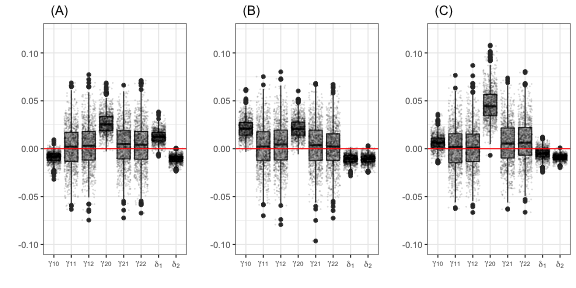
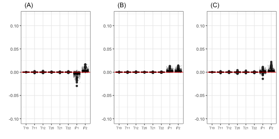

# A short Monte Carlo exercise: spsur vs spse.

The goal of this vignette is to present the results obtained in a Monte Carlo exercise to evaluate the performance of the Maximum Likelihood (ML) estimation of three spatial SUR models using the *R*-package **spsur** [@MinguezJSS2022; @Lopez2020]. The results will be compared with the same estimation using the **spse** *R*-package [@Piras2010] when it is possible. We compare the two basic spatial SUR models, named SUR-SLM and SUR-SEM. In the case of SUR-SARAR, we only present the results obtained with **spsur** because the estimation of this model is not available with **spse**.

The design of the Monte Carlo is as follows: We simulate a spatial SUR model with two equations (G = 2), where each equation includes an intercept and two explanatory variables plus the corresponding spatial terms. For the general model the equation is:

```{=tex}
\begin{equation}
y_i = (I_N-\rho_iW)^{-1}(\beta_{i0} + X_{i1}\beta_{i1} + X_{i2}\beta_{i2} + (I_N-\lambda_iW)^{-1}\epsilon_i); \ cov(\epsilon_i,\epsilon_j)=\sigma_{ij} ; \ i=1,2
(\#eq:sur)
\end{equation}
```

During the experiment, the $\beta$ parameters are fixed for every model taking the values $\beta_{10}=\beta_{20}=1$; $\beta_{11}=\beta_{21}=2$ and $\beta_{12}=\beta_{22}=3$. The variance-covariance matrix $\Sigma=(\sigma_{ij})$ is defined by $\sigma_{ij}=0.5 \ (i \neq j)$  and $\sigma_{ii}=1 \ (i=1,2)$. Two sample sizes, small and medium, are choosen (N=52, 516). A regular hexagonal layout is selected, from which the **W** matrix is obtained, based on the border contiguity between the hexagons (rook neighborhood type). Figure \ref{Fig:geometry} shows the hexagonal lattices for the case of N = 516. The $X_{ij}$ (i,j=1,2) variables are drawn from an independent U(0,1), and the error terms from a bivariate normal distribution with a variance-covariance matrix $\Sigma$. For all the experiments, 1,000 replications are performed.

Several combinations of parameters are selected to evaluate the performance of the ML algorithm under different levels of spatial dependence.

     SUR-SLM: $(\rho_1,\rho_2)=(-0.4,0.6);(0.5,0.5);(0.2,0.8)$ and $(\lambda_1,\lambda_2)=(0,0)$

     SUR-SEM: $(\rho_1,\rho_2)=(0,0)$ and $(\lambda_1,\lambda_2)=(-0.4,0.6);(0.5,0.5);(0.2,0.8)$

     SUR-SARAR: $(\rho_1,\rho_2)=(\lambda_1,\lambda_2)=(-0.4,0.6);(0.5,0.5);(0.2,0.8)$

These spatial processes have been generated using the function  *dgp_spsur()*, available in the **spsur** package. To evaluate the performance of the Maximum Likelihood estimation, we report bias and root mean-squared errors (RMSE) for all the combinations of the spatial parameters.


If **spsur** and **spse** needed to be installed, the first one  is available in the CRAN repository and the second one can be installed from the following GitHub repository:


```r
# install_github("gpiras/spse",force = TRUE)
library(spse)
```

The package **sf** is used to generate hexagonal and regular lattices with the number of hexagons prefixed and **spdep** to obtain the **W** matrix based on a common border.


```r
library(sf)
library(spdep)
sfc <- st_sfc(st_polygon(list(rbind(c(0,0),c(1,0),c(1,1),c(0,1),c(0,0)))))
hexs.N52.sf <- st_sf(st_make_grid(sfc, cellsize = .19, square = FALSE))
hexs.N525.sf <- st_sf(st_make_grid(sfc, cellsize = .05, square = FALSE))
listw.N52 <- as(hexs.N52.sf, "Spatial") %>% 
             poly2nb(queen = FALSE) %>% nb2listw()
listw.N525 <- as(hexs.N525.sf, "Spatial") %>% 
              poly2nb(queen = FALSE) %>% nb2listw()
```


# Maximum Likelihood estimation of SUR-SLM models

This section presents the results of a Monte Carlo exercise for the ML estimation of SUR-SLM models. 

```{=tex}
\begin{equation}
y_i = (I_N-\rho_iW)^{-1}(\beta_{i0} + X_{i1}\beta_{i1} + X_{i2}\beta_{i2} + \epsilon_i) \ ; \ cov(\epsilon_i,\epsilon_j)=\sigma_{ij} \ ; \ \ i=1,2
(\#eq:sur-sem)
\end{equation}
```

Table 1 shows the mean of the bias and the RMSE of the $\beta's$ and $\rho's$ parameters for the 1,000 replications. In general, all the results are coherent. The estimations with both *R*-packages show similar results. The highest bias is observed in the estimates of the intercept of the second equation for both packages. When the model is estimated with **spsur** the maximum bias is reached for N = 52  and  when the model is estimated with **spse** the maximum bias corresponds to N = 516. In general, the results confirm that for both packages, the estimates of the parameters of spatial dependence present low biases. The RMSE values decrease when the sample size increases, as expected.

<table style="margin-left:auto;margin-right:auto;text-align:center;border-collapse:collapse;">
  <caption id="tab-sur-slm-bias-rmse">Table 1: SUR-SLM Bias and RMSE. Maximum Likelihood</caption>
  <thead>
    <tr>
      <th>Pack</th>
      <th>N</th>
      <th>\(\rho_1\)</th>
      <th>\(\rho_2\)</th>
      <th>\(\hat{\beta}_{10}\)</th>
      <th>\(\hat{\beta}_{11}\)</th>
      <th>\(\hat{\beta}_{12}\)</th>
      <th>\(\hat{\beta}_{20}\)</th>
      <th>\(\hat{\beta}_{21}\)</th>
      <th>\(\hat{\beta}_{22}\)</th>
      <th>\(\hat{\rho}_1\)</th>
      <th>\(\hat{\rho}_2\)</th>
    </tr>
  </thead>
  <tbody>
    <!-- spsur (rowspan 12) -->
    <tr>
      <td rowspan="12">spsur</td>
      <td rowspan="6">52</td>
      <td rowspan="2">-0.4</td>
      <td rowspan="2">0.6</td>
      <td>0.009</td><td>0.001</td><td>0.001</td><td>0.036</td><td>0.001</td><td>-0.004</td><td>-0.007</td><td>-0.012</td>
    </tr>
    <tr>
      <td>(0.156)</td><td>(0.126)</td><td>(0.126)</td><td>(0.208)</td><td>(0.133)</td><td>(0.132)</td><td>(0.077)</td><td>(0.054)</td>
    </tr>
    <tr>
      <td rowspan="2">0.5</td>
      <td rowspan="2">0.5</td>
      <td>0.027</td><td>-0.002</td><td>0.001</td><td>0.027</td><td>0.001</td><td>0.000</td><td>-0.012</td><td>-0.011</td>
    </tr>
    <tr>
      <td>(0.201)</td><td>(0.129)</td><td>(0.129)</td><td>(0.199)</td><td>(0.132)</td><td>(0.126)</td><td>(0.061)</td><td>(0.059)</td>
    </tr>
    <tr>
      <td rowspan="2">0.2</td>
      <td rowspan="2">0.8</td>
      <td>0.017</td><td>-0.006</td><td>-0.001</td><td>0.065</td><td>0.006</td><td>0.002</td><td>-0.011</td><td>-0.012</td>
    </tr>
    <tr>
      <td>(0.178)</td><td>(0.124)</td><td>(0.126)</td><td>(0.276)</td><td>(0.129)</td><td>(0.126)</td><td>(0.071)</td><td>(0.040)</td>
    </tr>
    <tr>
      <td rowspan="6">516</td>
      <td rowspan="2">-0.4</td>
      <td rowspan="2">0.6</td>
      <td>-0.002</td><td>0.000</td><td>-0.000</td><td>0.001</td><td>0.002</td><td>0.001</td><td>-0.002</td><td>-0.001</td>
    </tr>
    <tr>
      <td>(0.047)</td><td>(0.038)</td><td>(0.040)</td><td>(0.058)</td><td>(0.040)</td><td>(0.041)</td><td>(0.025)</td><td>(0.015)</td>
    </tr>
    <tr>
      <td rowspan="2">0.5</td>
      <td rowspan="2">0.5</td>
      <td>0.000</td><td>-0.001</td><td>0.001</td><td>-0.001</td><td>-0.001</td><td>-0.001</td><td>-0.001</td><td>-0.001</td>
    </tr>
    <tr>
      <td>(0.057)</td><td>(0.039)</td><td>(0.041)</td><td>(0.058)</td><td>(0.039)</td><td>(0.041)</td><td>(0.017)</td><td>(0.017)</td>
    </tr>
    <tr>
      <td rowspan="2">0.2</td>
      <td rowspan="2">0.8</td>
      <td>0.003</td><td>0.001</td><td>-0.000</td><td>0.007</td><td>0.001</td><td>0.000</td><td>-0.001</td><td>-0.001</td>
    </tr>
    <tr>
      <td>(0.052)</td><td>(0.038)</td><td>(0.039)</td><td>(0.068)</td><td>(0.038)</td><td>(0.040)</td><td>(0.022)</td><td>(0.010)</td>
    </tr>
    <!-- spse (rowspan 12) -->
    <tr>
      <td rowspan="12">spse</td>
      <td rowspan="6">52</td>
      <td rowspan="2">-0.4</td>
      <td rowspan="2">0.6</td>
      <td>0.018</td><td>-0.001</td><td>-0.002</td><td>0.007</td><td>-0.004</td><td>-0.009</td><td>-0.021</td><td>-0.001</td>
    </tr>
    <tr>
      <td>(0.159)</td><td>(0.143)</td><td>(0.143)</td><td>(0.205)</td><td>(0.147)</td><td>(0.144)</td><td>(0.083)</td><td>(0.054)</td>
    </tr>
    <tr>
      <td rowspan="2">0.5</td>
      <td rowspan="2">0.5</td>
      <td>0.002</td><td>-0.003</td><td>-0.003</td><td>0.005</td><td>-0.003</td><td>-0.005</td><td>0.000</td><td>0.000</td>
    </tr>
    <tr>
      <td>(0.201)</td><td>(0.149)</td><td>(0.146)</td><td>(0.200)</td><td>(0.150)</td><td>(0.141)</td><td>(0.063)</td><td>(0.061)</td>
    </tr>
    <tr>
      <td rowspan="2">0.2</td>
      <td rowspan="2">0.8</td>
      <td>0.011</td><td>-0.002</td><td>-0.004</td><td>0.008</td><td>-0.001</td><td>-0.009</td><td>-0.006</td><td>-0.001</td>
    </tr>
    <tr>
      <td>(0.180)</td><td>(0.143)</td><td>(0.149)</td><td>(0.267)</td><td>(0.149)</td><td>(0.153)</td><td>(0.074)</td><td>(0.039)</td>
    </tr>
    <tr>
      <td rowspan="6">516</td>
      <td rowspan="2">-0.4</td>
      <td rowspan="2">0.6</td>
      <td>0.007</td><td>-0.001</td><td>-0.004</td><td>-0.025</td><td>-0.002</td><td>-0.003</td><td>-0.014</td><td>0.009</td>
    </tr>
    <tr>
      <td>(0.049)</td><td>(0.044)</td><td>(0.045)</td><td>(0.063)</td><td>(0.046)</td><td>(0.048)</td><td>(0.030)</td><td>(0.018)</td>
    </tr>
    <tr>
      <td rowspan="2">0.5</td>
      <td rowspan="2">0.5</td>
      <td>-0.021</td><td>-0.003</td><td>-0.003</td><td>-0.022</td><td>-0.004</td><td>-0.003</td><td>0.010</td><td>0.010</td>
    </tr>
    <tr>
      <td>(0.061)</td><td>(0.045)</td><td>(0.047)</td><td>(0.063)</td><td>(0.045)</td><td>(0.046)</td><td>(0.020)</td><td>(0.020)</td>
    </tr>
    <tr>
      <td rowspan="2">0.2</td>
      <td rowspan="2">0.8</td>
      <td>-0.004</td><td>0.000</td><td>-0.001</td><td>-0.039</td><td>-0.005</td><td>-0.007</td><td>0.004</td><td>0.008</td>
    </tr>
    <tr>
      <td>(0.053)</td><td>(0.044)</td><td>(0.044)</td><td>(0.078)</td><td>(0.043)</td><td>(0.045)</td><td>(0.023)</td><td>(0.013)</td>
    </tr>
  </tbody>
</table>


Figure 1 shows the boxplots of  $\gamma_{ij}=\hat\beta_{ij}^{spsur}-\hat\beta_{ij}^{spse}$ and $\delta_i=\hat\rho_{i}^{spsur}-\hat\rho_{i}^{spse}$, the difference between estimated parameters 'model to model' for N = 516 (the superscript indicates the package used to estimate the coefficient). These boxplots confirm that the main differences are founded in the intercept of the second equation.





# Maximum Likelihood estimation of SUR-SEM models

Table 2 shows the results of the bias and RMSE for the estimation of an SUR-SEM model with both R-packages. In general terms, the biases of the estimated parameters are lower than 0.01 in absolute values for all $\beta$ parameters. The estimation of the $\lambda's$ parameters for small sample (N = 52) has a bias higher than 0.01 with a tendency toward the underestimation in all the cases. For medium sample sizes (N = 516), the bias is lower than 0.01. The RMSE decreases when the sample size increase as expected.

<table style="margin-left:auto;margin-right:auto;text-align:center;border-collapse:collapse;">
  <caption id="tab-print-table-2">Table 2: Bias and RMSE. SUR-SEM Maximum Likelihood</caption>
  <thead>
    <tr>
      <th>Pack</th>
      <th>N</th>
      <th>\(\lambda_1\)</th>
      <th>\(\lambda_2\)</th>
      <th>\(\hat{\beta}_{10}\)</th>
      <th>\(\hat{\beta}_{11}\)</th>
      <th>\(\hat{\beta}_{12}\)</th>
      <th>\(\hat{\beta}_{20}\)</th>
      <th>\(\hat{\beta}_{21}\)</th>
      <th>\(\hat{\beta}_{22}\)</th>
      <th>\(\hat{\lambda}_1\)</th>
      <th>\(\hat{\lambda}_2\)</th>
    </tr>
  </thead>
  <tbody>
    <!-- spsur (rowspan 12) -->
    <tr>
      <td rowspan="12">spsur</td>
      <td rowspan="6">52</td>
      <td rowspan="2">-0.4</td>
      <td rowspan="2">0.6</td>
      <td>0.004</td><td>0.005</td><td>0.003</td><td>0.008</td><td>0.002</td><td>-0.006</td><td>-0.071</td><td>-0.080</td>
    </tr>
    <tr>
      <td>(0.103)</td><td>(0.127)</td><td>(0.122)</td><td>(0.357)</td><td>(0.128)</td><td>(0.124)</td><td>(0.239)</td><td>(0.174)</td>
    </tr>
    <tr>
      <td rowspan="2">0.5</td>
      <td rowspan="2">0.5</td>
      <td>0.006</td><td>-0.001</td><td>0.003</td><td>0.006</td><td>-0.001</td><td>0.001</td><td>-0.070</td><td>-0.086</td>
    </tr>
    <tr>
      <td>(0.289)</td><td>(0.125)</td><td>(0.126)</td><td>(0.286)</td><td>(0.126)</td><td>(0.123)</td><td>(0.186)</td><td>(0.190)</td>
    </tr>
    <tr>
      <td rowspan="2">0.2</td>
      <td rowspan="2">0.8</td>
      <td>0.003</td><td>-0.003</td><td>0.000</td><td>0.021</td><td>0.002</td><td>-0.003</td><td>-0.082</td><td>-0.074</td>
    </tr>
    <tr>
      <td>(0.174)</td><td>(0.123)</td><td>(0.127)</td><td>(0.688)</td><td>(0.117)</td><td>(0.115)</td><td>(0.228)</td><td>(0.138)</td>
    </tr>
    <tr>
      <td rowspan="6">516</td>
      <td rowspan="2">-0.4</td>
      <td rowspan="2">0.6</td>
      <td>-0.002</td><td>0.001</td><td>-0.000</td><td>-0.004</td><td>0.002</td><td>0.001</td><td>-0.008</td><td>-0.008</td>
    </tr>
    <tr>
      <td>(0.030)</td><td>(0.037)</td><td>(0.039)</td><td>(0.110)</td><td>(0.038)</td><td>(0.039)</td><td>(0.073)</td><td>(0.046)</td>
    </tr>
    <tr>
      <td rowspan="2">0.5</td>
      <td rowspan="2">0.5</td>
      <td>-0.004</td><td>-0.001</td><td>0.001</td><td>-0.007</td><td>-0.001</td><td>-0.001</td><td>-0.005</td><td>-0.009</td>
    </tr>
    <tr>
      <td>(0.089)</td><td>(0.038)</td><td>(0.040)</td><td>(0.091)</td><td>(0.038)</td><td>(0.040)</td><td>(0.050)</td><td>(0.052)</td>
    </tr>
    <tr>
      <td rowspan="2">0.2</td>
      <td rowspan="2">0.8</td>
      <td>0.001</td><td>0.001</td><td>0.000</td><td>0.015</td><td>0.000</td><td>0.000</td><td>-0.010</td><td>-0.007</td>
    </tr>
    <tr>
      <td>(0.055)</td><td>(0.038)</td><td>(0.038)</td><td>(0.225)</td><td>(0.035)</td><td>(0.037)</td><td>(0.063)</td><td>(0.031)</td>
    </tr>
    <!-- spse (rowspan 12) -->
    <tr>
      <td rowspan="12">spse</td>
      <td rowspan="6">52</td>
      <td rowspan="2">-0.4</td>
      <td rowspan="2">0.6</td>
      <td>0.004</td><td>0.005</td><td>0.004</td><td>0.008</td><td>0.002</td><td>-0.007</td><td>-0.033</td><td>-0.107</td>
    </tr>
    <tr>
      <td>(0.103)</td><td>(0.126)</td><td>(0.122)</td><td>(0.357)</td><td>(0.129)</td><td>(0.125)</td><td>(0.214)</td><td>(0.185)</td>
    </tr>
    <tr>
      <td rowspan="2">0.5</td>
      <td rowspan="2">0.5</td>
      <td>0.006</td><td>-0.001</td><td>0.003</td><td>0.006</td><td>-0.001</td><td>0.001</td><td>-0.091</td><td>-0.106</td>
    </tr>
    <tr>
      <td>(0.289)</td><td>(0.126)</td><td>(0.126)</td><td>(0.286)</td><td>(0.127)</td><td>(0.123)</td><td>(0.190)</td><td>(0.195)</td>
    </tr>
    <tr>
      <td rowspan="2">0.2</td>
      <td rowspan="2">0.8</td>
      <td>0.003</td><td>-0.003</td><td>0.001</td><td>0.022</td><td>0.001</td><td>-0.003</td><td>-0.087</td><td>-0.103</td>
    </tr>
    <tr>
      <td>(0.174)</td><td>(0.122)</td><td>(0.126)</td><td>(0.687)</td><td>(0.118)</td><td>(0.117)</td><td>(0.218)</td><td>(0.158)</td>
    </tr>
    <tr>
      <td rowspan="6">516</td>
      <td rowspan="2">-0.4</td>
      <td rowspan="2">0.6</td>
      <td>-0.002</td><td>0.001</td><td>-0.000</td><td>-0.004</td><td>0.002</td><td>0.001</td><td>-0.005</td><td>-0.011</td>
    </tr>
    <tr>
      <td>(0.030)</td><td>(0.037)</td><td>(0.039)</td><td>(0.110)</td><td>(0.038)</td><td>(0.039)</td><td>(0.072)</td><td>(0.046)</td>
    </tr>
    <tr>
      <td rowspan="2">0.5</td>
      <td rowspan="2">0.5</td>
      <td>-0.004</td><td>-0.001</td><td>0.001</td><td>-0.007</td><td>-0.001</td><td>-0.001</td><td>-0.008</td><td>-0.012</td>
    </tr>
    <tr>
      <td>(0.089)</td><td>(0.038)</td><td>(0.040)</td><td>(0.091)</td><td>(0.038)</td><td>(0.040)</td><td>(0.050)</td><td>(0.053)</td>
    </tr>
    <tr>
      <td rowspan="2">0.2</td>
      <td rowspan="2">0.8</td>
      <td>0.001</td><td>0.001</td><td>0.000</td><td>0.015</td><td>0.000</td><td>0.000</td><td>-0.011</td><td>-0.009</td>
    </tr>
    <tr>
      <td>(0.055)</td><td>(0.038)</td><td>(0.038)</td><td>(0.225)</td><td>(0.035)</td><td>(0.037)</td><td>(0.063)</td><td>(0.032)</td>
    </tr>
  </tbody>
</table>


As in the case of SUR-SLM, the Figure 2 shows the difference between the parameters estimated with **spsur** and **spse** for N = 516. These boxplots show that the biases in the SUR-SEM are lower than in the SUR-SLM for all the parameters.




# Maximum Likelihood estimation of SUR-SARAR models

Table 3 shows the results obtained for the bias and RMSE for the LM estimation of SUR-SARAR models. For this model, only the results obtained with the **spsur** package can be shown because this specification is not available for the **spse** package. As in the case of the estimations of the SUR-SLM and SUR-SEM models the worst results in terms of bias and RMSE are obtained when the sample size is small (N = 52). In the case of N = 52 the $\lambda's$ parameters are underestimated. This underestimation disappears when the sample size is medium (N = 516).


<table class="table table-striped" style="font-size: 7px; margin-left: auto; margin-right: auto;">
<caption style="font-size: initial !important;">Table 3: SUR-SARAR Bias and RMSE (in brackets). Maximum Likelihood with spsur</caption>
 <thead>
  <tr>
   <th style="text-align:center;"> N </th>
   <th style="text-align:center;"> $\rho_1;\lambda_1$ </th>
   <th style="text-align:center;"> $\rho_2;\lambda_2$ </th>
   <th style="text-align:center;"> $\hat\beta_{10}$ </th>
   <th style="text-align:center;"> $\hat\beta_{11}$ </th>
   <th style="text-align:center;"> $\hat\beta_{12}$ </th>
   <th style="text-align:center;"> $\hat\beta_{20}$ </th>
   <th style="text-align:center;"> $\hat\beta_{21}$ </th>
   <th style="text-align:center;"> $\hat\beta_{22}$ </th>
   <th style="text-align:center;"> $\hat\rho_1$ </th>
   <th style="text-align:center;"> $\hat\rho_2$ </th>
   <th style="text-align:center;"> $\hat\lambda_1$ </th>
   <th style="text-align:center;"> $\hat\lambda_2$ </th>
  </tr>
 </thead>
<tbody>
  <tr>
   <td style="text-align:center;"> 52 </td>
   <td style="text-align:center;"> -0.4 </td>
   <td style="text-align:center;"> 0.6 </td>
   <td style="text-align:center;"> 0.005 </td>
   <td style="text-align:center;"> 0.003 </td>
   <td style="text-align:center;"> 0.002 </td>
   <td style="text-align:center;"> 0.032 </td>
   <td style="text-align:center;"> -0.002 </td>
   <td style="text-align:center;"> -0.012 </td>
   <td style="text-align:center;"> -0.003 </td>
   <td style="text-align:center;"> -0.009 </td>
   <td style="text-align:center;"> -0.077 </td>
   <td style="text-align:center;"> -0.104 </td>
  </tr>
  <tr>
   <td style="text-align:center;"> 52 </td>
   <td style="text-align:center;"> -0.4 </td>
   <td style="text-align:center;"> 0.6 </td>
   <td style="text-align:center;"> (0.121) </td>
   <td style="text-align:center;"> (0.127) </td>
   <td style="text-align:center;"> (0.124) </td>
   <td style="text-align:center;"> (0.439) </td>
   <td style="text-align:center;"> (0.133) </td>
   <td style="text-align:center;"> (0.131) </td>
   <td style="text-align:center;"> (0.080) </td>
   <td style="text-align:center;"> (0.083) </td>
   <td style="text-align:center;"> (0.252) </td>
   <td style="text-align:center;"> (0.210) </td>
  </tr>
  <tr>
   <td style="text-align:center;"> 52 </td>
   <td style="text-align:center;"> 0.5 </td>
   <td style="text-align:center;"> 0.5 </td>
   <td style="text-align:center;"> 0.027 </td>
   <td style="text-align:center;"> -0.007 </td>
   <td style="text-align:center;"> -0.005 </td>
   <td style="text-align:center;"> 0.014 </td>
   <td style="text-align:center;"> -0.003 </td>
   <td style="text-align:center;"> -0.004 </td>
   <td style="text-align:center;"> -0.010 </td>
   <td style="text-align:center;"> -0.003 </td>
   <td style="text-align:center;"> -0.094 </td>
   <td style="text-align:center;"> -0.117 </td>
  </tr>
  <tr>
   <td style="text-align:center;"> 52 </td>
   <td style="text-align:center;"> 0.5 </td>
   <td style="text-align:center;"> 0.5 </td>
   <td style="text-align:center;"> (0.365) </td>
   <td style="text-align:center;"> (0.130) </td>
   <td style="text-align:center;"> (0.129) </td>
   <td style="text-align:center;"> (0.345) </td>
   <td style="text-align:center;"> (0.130) </td>
   <td style="text-align:center;"> (0.128) </td>
   <td style="text-align:center;"> (0.089) </td>
   <td style="text-align:center;"> (0.084) </td>
   <td style="text-align:center;"> (0.229) </td>
   <td style="text-align:center;"> (0.231) </td>
  </tr>
  <tr>
   <td style="text-align:center;"> 52 </td>
   <td style="text-align:center;"> 0.2 </td>
   <td style="text-align:center;"> 0.8 </td>
   <td style="text-align:center;"> 0.010 </td>
   <td style="text-align:center;"> -0.007 </td>
   <td style="text-align:center;"> -0.004 </td>
   <td style="text-align:center;"> 0.098 </td>
   <td style="text-align:center;"> -0.002 </td>
   <td style="text-align:center;"> -0.009 </td>
   <td style="text-align:center;"> -0.006 </td>
   <td style="text-align:center;"> -0.013 </td>
   <td style="text-align:center;"> -0.103 </td>
   <td style="text-align:center;"> -0.093 </td>
  </tr>
  <tr>
   <td style="text-align:center;"> 52 </td>
   <td style="text-align:center;"> 0.2 </td>
   <td style="text-align:center;"> 0.8 </td>
   <td style="text-align:center;"> (0.214) </td>
   <td style="text-align:center;"> (0.126) </td>
   <td style="text-align:center;"> (0.127) </td>
   <td style="text-align:center;"> (0.931) </td>
   <td style="text-align:center;"> (0.122) </td>
   <td style="text-align:center;"> (0.123) </td>
   <td style="text-align:center;"> (0.083) </td>
   <td style="text-align:center;"> (0.080) </td>
   <td style="text-align:center;"> (0.253) </td>
   <td style="text-align:center;"> (0.177) </td>
  </tr>
  <tr>
   <td style="text-align:center;"> 516 </td>
   <td style="text-align:center;"> -0.4 </td>
   <td style="text-align:center;"> 0.6 </td>
   <td style="text-align:center;"> -0.001 </td>
   <td style="text-align:center;"> 0.001 </td>
   <td style="text-align:center;"> -0.000 </td>
   <td style="text-align:center;"> -0.002 </td>
   <td style="text-align:center;"> 0.002 </td>
   <td style="text-align:center;"> 0.000 </td>
   <td style="text-align:center;"> -0.001 </td>
   <td style="text-align:center;"> -0.001 </td>
   <td style="text-align:center;"> -0.008 </td>
   <td style="text-align:center;"> -0.010 </td>
  </tr>
  <tr>
   <td style="text-align:center;"> 516 </td>
   <td style="text-align:center;"> -0.4 </td>
   <td style="text-align:center;"> 0.6 </td>
   <td style="text-align:center;"> (0.036) </td>
   <td style="text-align:center;"> (0.037) </td>
   <td style="text-align:center;"> (0.039) </td>
   <td style="text-align:center;"> (0.127) </td>
   <td style="text-align:center;"> (0.039) </td>
   <td style="text-align:center;"> (0.040) </td>
   <td style="text-align:center;"> (0.025) </td>
   <td style="text-align:center;"> (0.026) </td>
   <td style="text-align:center;"> (0.076) </td>
   <td style="text-align:center;"> (0.053) </td>
  </tr>
  <tr>
   <td style="text-align:center;"> 516 </td>
   <td style="text-align:center;"> 0.5 </td>
   <td style="text-align:center;"> 0.5 </td>
   <td style="text-align:center;"> -0.002 </td>
   <td style="text-align:center;"> -0.001 </td>
   <td style="text-align:center;"> 0.000 </td>
   <td style="text-align:center;"> -0.006 </td>
   <td style="text-align:center;"> -0.001 </td>
   <td style="text-align:center;"> -0.002 </td>
   <td style="text-align:center;"> -0.001 </td>
   <td style="text-align:center;"> -0.001 </td>
   <td style="text-align:center;"> -0.008 </td>
   <td style="text-align:center;"> -0.012 </td>
  </tr>
  <tr>
   <td style="text-align:center;"> 516 </td>
   <td style="text-align:center;"> 0.5 </td>
   <td style="text-align:center;"> 0.5 </td>
   <td style="text-align:center;"> (0.106) </td>
   <td style="text-align:center;"> (0.038) </td>
   <td style="text-align:center;"> (0.041) </td>
   <td style="text-align:center;"> (0.106) </td>
   <td style="text-align:center;"> (0.038) </td>
   <td style="text-align:center;"> (0.041) </td>
   <td style="text-align:center;"> (0.026) </td>
   <td style="text-align:center;"> (0.026) </td>
   <td style="text-align:center;"> (0.058) </td>
   <td style="text-align:center;"> (0.059) </td>
  </tr>
  <tr>
   <td style="text-align:center;"> 516 </td>
   <td style="text-align:center;"> 0.2 </td>
   <td style="text-align:center;"> 0.8 </td>
   <td style="text-align:center;"> 0.002 </td>
   <td style="text-align:center;"> 0.001 </td>
   <td style="text-align:center;"> -0.000 </td>
   <td style="text-align:center;"> 0.021 </td>
   <td style="text-align:center;"> -0.000 </td>
   <td style="text-align:center;"> -0.001 </td>
   <td style="text-align:center;"> -0.000 </td>
   <td style="text-align:center;"> -0.001 </td>
   <td style="text-align:center;"> -0.013 </td>
   <td style="text-align:center;"> -0.009 </td>
  </tr>
  <tr>
   <td style="text-align:center;"> 516 </td>
   <td style="text-align:center;"> 0.2 </td>
   <td style="text-align:center;"> 0.8 </td>
   <td style="text-align:center;"> (0.064) </td>
   <td style="text-align:center;"> (0.038) </td>
   <td style="text-align:center;"> (0.038) </td>
   <td style="text-align:center;"> (0.262) </td>
   <td style="text-align:center;"> (0.036) </td>
   <td style="text-align:center;"> (0.038) </td>
   <td style="text-align:center;"> (0.025) </td>
   <td style="text-align:center;"> (0.025) </td>
   <td style="text-align:center;"> (0.070) </td>
   <td style="text-align:center;"> (0.041) </td>
  </tr>
</tbody>
</table>

# Conclusion

This vignette shows the results of a sort Monte Carlo exercise to evaluate the ML estimation of three spatial SUR models, SUR-SLM, SUR-SEM, and SUR-SARAR. The first two models are estimated with the **spsur** and **spse** packages and the results are compared. In the case of the SUR-SARAR model only the results using the **spsur** are presented because the estimation of SUR-SARAR is no available.

In general, both packages present admissible results. When comparing the estimates of the coefficients for SUR-SLM some differences emerge, mainly in the estimation of the intercepts. In the case of SUR-SEM both *R*-packages give similar results for small and medium sample sizes.

A full Monte Carlo using irregular lattices, alternative **W** matrices, and non-ideal conditions would shed more light on the performance of the ML algorithm implemented in both *R*-packages. 

# References

