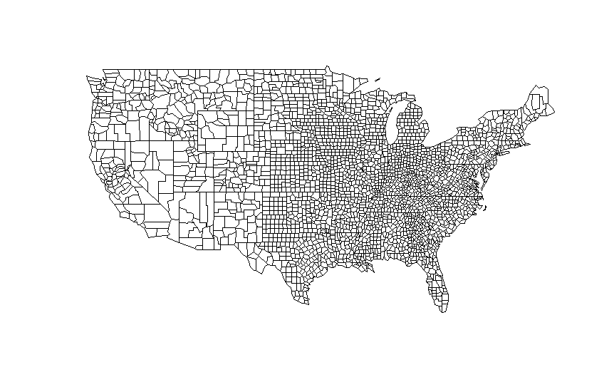

```{r setup, echo = FALSE}
knitr::opts_chunk$set(
  comment = "#>",
  warning = FALSE, message = FALSE, 
  echo = TRUE, eval = FALSE)
```

```{r loadpackages}
library(spsur)
library(spdep)
library(spatialreg)
library(sf)
```

# Introduction

The **spsur** R-package (@LopezMinguezMur2020) has been designed for estimate spatial regression models in a multiequational framework. However, because of its flexibility, it is also possible to obtain useful results for uniequational models. On the oher hand, the **spatialreg** package ( @BivandPedesma2013; @BivandPiras2015), is the most adequate alternative for working with uniequational models, in a pure cross-sectional setting. The purpose of this vignette is to compare the results of **spsur** and **spatialreg** in case of *uniequational models*. As we will see, the differences between the two are negligible.

In sum, the purpose of this vignette is to compare the results of **spsur** and **spatialreg** in the following issues:

* Estimation of spatially independent model, or SIM models.
* Lagrange Multiplier misspecification tests for SIM models.
* ML estimation of SLM, SEM, SARAR models.
* 3SLS estimation of SLM and SDM models.

# The data set NCOVR

Throughout the vignette we use the dataset NCOVR (National Consortium on Violence Research). These data were employed by @Baller2001 to analyze the incidence of homicides rates in the US counties. The dataset can be freely dowloaded from
**https://geodacenter.github.io/data-and-lab/ncovr/**

NCOVR contains 3085 spatial units (counties), for 4 different cross-sections (1960, 1970, 1980, 1990) and 69 variables. According to @Baller2001, the main variables of interest are:

* HR: homicide rate per 100000 inhabitants
* RD: resource deprivation 
* PS: population structure 
* MA: median age
* DV: divorce rate (% males over 14 divorced)
* UE: unemployment rate 
* SOUTH: dummy variable for Southern counties (South = 1)

First, we can read the NCOVR dataset as a simple feature (sf) object (named NCOVR.sf),

```{r data_set}
data(NCOVR, package = "spsur")
```

The first three observations in NCOVR appear below:

```{r printdatatable}
NCOVR <- st_drop_geometry(NCOVR.sf)
knitr::kable(
  head((NCOVR[1:3, 1:6])),
  caption = 'First observations of NCOVR dataset' )
```
<div class="kable-table">
<table>
<caption><span id="tab:printdatatable">Table 2.1: </span>First observations of NCOVR dataset</caption>
<thead>
<tr class="header">
<th align="left">NAME</th>
<th align="left">STATE_NAME</th>
<th align="left">FIPS</th>
<th align="right">SOUTH</th>
<th align="right">HR60</th>
<th align="right">HR70</th>
</tr>
</thead>
<tbody>
<tr class="odd">
<td align="left">Lake of the Woods</td>
<td align="left">Minnesota</td>
<td align="left">27077</td>
<td align="right">0</td>
<td align="right">0.000000</td>
<td align="right">0.000000</td>
</tr>
<tr class="even">
<td align="left">Ferry</td>
<td align="left">Washington</td>
<td align="left">53019</td>
<td align="right">0</td>
<td align="right">0.000000</td>
<td align="right">0.000000</td>
</tr>
<tr class="odd">
<td align="left">Stevens</td>
<td align="left">Washington</td>
<td align="left">53065</td>
<td align="right">0</td>
<td align="right">1.863863</td>
<td align="right">1.915158</td>
</tr>
</tbody>
</table>
</div>

Whereas the geometry of the USA counties is shown in Figure <a href="#fig:plotgeom">2.1</a>:

```{r plotgeom, fig.cap = "Geometry of the USA counties", fig.align='center'}
plot(st_geometry(NCOVR.sf))
```
<div class="figure" style="text-align: center"><span id="fig:plotgeom"></span>

<p class="caption">
Figure 2.1: Geometry of the USA counties
</p>
</div>

Following @Baller2001, we consider a **W** matrix based on the criterion of 10 nearest-neighbourhood, which is immediate to obtain using the **spdep** package (@BivandPedesma2013; @BivandWong2018). The resulting weighting matrix will be called *listw*. Note that this matrix is non-symmetric and it is row-standardized.

```{r W}
# Obtain coordinates of centroids
co <- sf::st_coordinates(sf::st_centroid(NCOVR.sf))
listw <- spdep::nb2listw(spdep::knn2nb(spdep::knearneigh(co, k = 10,longlat = TRUE)))
```

@Baller2001 specify a single linear model to explain the case of HR in the year 1960:

\begin{equation}
HR_{60} = \beta_{0}+\beta_{1}RD_{60}+\beta_{2}PS_{60}+\beta_{3}MA_{60}+\beta_{4}DV_{60} +\beta_{5}UE_{60} +\beta_{6}SOUTH+\epsilon_{60} 
(\#eq:ols)
\end{equation}

This model can be estimated in usual way with the function `stats::lm` (@R2019),

```{r ols_60sr}
formula_60 <- HR60 ~ RD60 + PS60 + MA60 + DV60 + UE60 + SOUTH
lm_60 <- lm(formula = formula_60, data = NCOVR.sf)
summary(lm_60)
```

<pre><code>
#&gt; 
#&gt; Call:
#&gt; lm(formula = formula_60, data = NCOVR.sf)
#&gt; 
#&gt; Residuals:
#&gt;     Min      1Q  Median      3Q     Max 
#&gt; -14.026  -2.217  -0.635   1.393  88.312 
#&gt; 
#&gt; Coefficients:
#&gt;             Estimate Std. Error t value Pr(&gt;|t|)    
#&gt; (Intercept)  8.12591    0.63465  12.804  &lt; 2e-16 ***
#&gt; RD60         1.79824    0.12341  14.571  &lt; 2e-16 ***
#&gt; PS60         0.35871    0.09216   3.892 0.000101 ***
#&gt; MA60        -0.23047    0.01932 -11.931  &lt; 2e-16 ***
#&gt; DV60         1.16002    0.09483  12.233  &lt; 2e-16 ***
#&gt; UE60        -0.06195    0.03515  -1.762 0.078138 .  
#&gt; SOUTH        2.63862    0.23325  11.312  &lt; 2e-16 ***
#&gt; ---
#&gt; Signif. codes:  0 &#39;***&#39; 0.001 &#39;**&#39; 0.01 &#39;*&#39; 0.05 &#39;.&#39; 0.1 &#39; &#39; 1
#&gt; 
#&gt; Residual standard error: 4.743 on 3078 degrees of freedom
#&gt; Multiple R-squared:  0.2966, Adjusted R-squared:  0.2952 
#&gt; F-statistic: 216.3 on 6 and 3078 DF,  p-value: &lt; 2.2e-16
</code></pre>


The same results can be obtained with the function `spsurml` from **spsur**, selecting the argument *type = "sim"*

```{r sur-sim}
ols.spsur <- spsurml(formula = formula_60, type = "sim", 
                     data = NCOVR.sf)
summary(ols.spsur)
```

<pre><code>
#&gt; Initial point:  
#&gt; log_lik:  -9176.338 
#&gt; Iteration:  1  log_lik:  -9176.338 
#&gt; Time to fit the model:  0.06  seconds
#&gt; Time to compute covariances:  0  seconds
#&gt; Call:
#&gt; spsurml(formula = formula_60, data = NCOVR.sf, type = &quot;sim&quot;)
#&gt; 
#&gt;  
#&gt; Spatial SUR model type:  sim 
#&gt; 
#&gt; Equation  1 
#&gt;                Estimate Std. Error  t value  Pr(&gt;|t|)    
#&gt; (Intercept)_1  8.125915   0.634033  12.8162 &lt; 2.2e-16 ***
#&gt; RD60_1         1.798240   0.123294  14.5850 &lt; 2.2e-16 ***
#&gt; PS60_1         0.358706   0.092069   3.8960 9.986e-05 ***
#&gt; MA60_1        -0.230475   0.019298 -11.9428 &lt; 2.2e-16 ***
#&gt; DV60_1         1.160020   0.094737  12.2446 &lt; 2.2e-16 ***
#&gt; UE60_1        -0.061948   0.035120  -1.7639   0.07785 .  
#&gt; SOUTH_1        2.638618   0.233024  11.3234 &lt; 2.2e-16 ***
#&gt; ---
#&gt; Signif. codes:  0 &#39;***&#39; 0.001 &#39;**&#39; 0.01 &#39;*&#39; 0.05 &#39;.&#39; 0.1 &#39; &#39; 1
#&gt; R-squared: 0.2966 
#&gt;   
#&gt; Residual standard error:  4.739
</code></pre>

The two functions, `stats::lm` and `spsurml`, produce identical results. The output of `spsurml` is shorter than that of `lm` so, depending on the necessities of the user, he/she can choose between `lm` and `spsurml` without loss of information. If you want all the estimation details, then use `lm`.

# LM tests for spatial autocorrelation

The existence of omitted spatial dependence in the results of a SIM model, estimated by LS, can be tested by using the classical LM tests. The function `spdep::lm.LMtests` report the values of these Lagrange Multipliers

```{r}
lmtest.spdep <- spdep::lm.LMtests(lm_60, listw, test = "all")
print(lmtest.spdep)
```

<pre><code>#&gt; 
#&gt;  Lagrange multiplier diagnostics for spatial dependence
#&gt; 
#&gt; data:  
#&gt; model: lm(formula = formula_60, data = NCOVR.sf)
#&gt; weights: listw
#&gt; 
#&gt; LMerr = 208.12, df = 1, p-value &lt; 2.2e-16
#&gt; 
#&gt; 
#&gt;  Lagrange multiplier diagnostics for spatial dependence
#&gt; 
#&gt; data:  
#&gt; model: lm(formula = formula_60, data = NCOVR.sf)
#&gt; weights: listw
#&gt; 
#&gt; LMlag = 232.1, df = 1, p-value &lt; 2.2e-16
#&gt; 
#&gt; 
#&gt;  Lagrange multiplier diagnostics for spatial dependence
#&gt; 
#&gt; data:  
#&gt; model: lm(formula = formula_60, data = NCOVR.sf)
#&gt; weights: listw
#&gt; 
#&gt; RLMerr = 1.1565, df = 1, p-value = 0.2822
#&gt; 
#&gt; 
#&gt;  Lagrange multiplier diagnostics for spatial dependence
#&gt; 
#&gt; data:  
#&gt; model: lm(formula = formula_60, data = NCOVR.sf)
#&gt; weights: listw
#&gt; 
#&gt; RLMlag = 25.138, df = 1, p-value = 5.337e-07
#&gt; 
#&gt; 
#&gt;  Lagrange multiplier diagnostics for spatial dependence
#&gt; 
#&gt; data:  
#&gt; model: lm(formula = formula_60, data = NCOVR.sf)
#&gt; weights: listw
#&gt; 
#&gt; SARMA = 233.25, df = 2, p-value &lt; 2.2e-16
</code></pre>

The same tests can be obtained with the function `lmtestspsur`

```{r test_SUR-SIM}
lmtest.spsur <- lmtestspsur(formula = formula_60, listw = listw, 
                            data = NCOVR.sf)
print(lmtest.spsur)
```

<pre><code>#&gt; [[1]]
#&gt; 
#&gt;  LM-SUR-SLM
#&gt; 
#&gt; data:  NCOVR.sf
#&gt; LM-stat = 231.96, df = 1, p-value &lt; 2.2e-16
#&gt; 
#&gt; 
#&gt; [[2]]
#&gt; 
#&gt;  LM-SUR-SEM
#&gt; 
#&gt; data:  NCOVR.sf
#&gt; LM-stat = 207.98, df = 1, p-value &lt; 2.2e-16
#&gt; 
#&gt; 
#&gt; [[3]]
#&gt; 
#&gt;  LM*-SUR-SLM
#&gt; 
#&gt; data:  NCOVR.sf
#&gt; LM-stat = 25.13, df = 1, p-value = 5.36e-07
#&gt; 
#&gt; 
#&gt; [[4]]
#&gt; 
#&gt;  LM*-SUR-SEM
#&gt; 
#&gt; data:  NCOVR.sf
#&gt; LM-stat = 1.1523, df = 1, p-value = 0.2831
#&gt; 
#&gt; 
#&gt; [[5]]
#&gt; 
#&gt;  LM-SUR-SARAR
#&gt; 
#&gt; data:  NCOVR.sf
#&gt; LM-stat = 233.11, df = 2, p-value &lt; 2.2e-16
</code></pre>

Note that the ordering of the battery of Lagrange Multipliers is not the same. Otherwise, the results are almost identical.

# The Spatial Lag Model

Both R packages **spatialreg** and **spsur** can estimate Spatial Lag Models for a single cross-section. Continuing with the example before, the model that we want to estimate is:

$$
\begin{equation}
HR_{60} = \rho W HR_{60} +\beta_{0}+\beta_{1}RD_{60}+\beta_{2}PS_{60}+\beta_{3}MA_{60}+\beta_{4}DV_{60} +\beta_{5}UE_{60} +\beta_{6}SOUTH+\epsilon_{60}\
(\#eq:slm)
\end{equation}
$$

The ML estimation of equation \@ref(eq:slm) using the function `spsurml()` of **spsur** renders the following results:


```{r SUR-SLM}
slm.spsur <- spsur::spsurml(formula = formula_60, type = "slm", 
                            listw = listw, data = NCOVR.sf)
summary(slm.spsur)
```

<pre><code>
#&gt; neighbourhood matrix eigenvalues
#&gt; Computing eigenvalues ...
#&gt; 
#&gt; Initial point:   log_lik:  -9101.721  rhos:  0.364 
#&gt; Iteration:  1   log_lik:  -9098.57  rhos:  0.37 
#&gt; Iteration:  2   log_lik:  -9098.569  rhos:  0.37 
#&gt; Time to fit the model:  0.92  seconds
#&gt; Time to compute covariances:  5.39  seconds
#&gt; Call:
#&gt; spsur::spsurml(formula = formula_60, data = NCOVR.sf, listw = listw, 
#&gt;     type = &quot;slm&quot;)
#&gt; 
#&gt;  
#&gt; Spatial SUR model type:  slm 
#&gt; 
#&gt; Equation  1 
#&gt;                Estimate Std. Error t value  Pr(&gt;|t|)    
#&gt; (Intercept)_1  5.475515   0.647627  8.4547 &lt; 2.2e-16 ***
#&gt; RD60_1         1.358071   0.125738 10.8008 &lt; 2.2e-16 ***
#&gt; PS60_1         0.284375   0.089320  3.1838  0.001468 ** 
#&gt; MA60_1        -0.165479   0.019384 -8.5367 &lt; 2.2e-16 ***
#&gt; DV60_1         0.884739   0.093725  9.4398 &lt; 2.2e-16 ***
#&gt; UE60_1        -0.021741   0.034004 -0.6394  0.522641    
#&gt; SOUTH_1        1.355704   0.244626  5.5419 3.244e-08 ***
#&gt; rho_1          0.370414   0.030275 12.2350 &lt; 2.2e-16 ***
#&gt; ---
#&gt; Signif. codes:  0 &#39;***&#39; 0.001 &#39;**&#39; 0.01 &#39;*&#39; 0.05 &#39;.&#39; 0.1 &#39; &#39; 1
#&gt; R-squared: 0.3409 
#&gt;   
#&gt; Residual standard error:  4.588
#&gt;  LMM: 22.393  p-value: (2.22e-06)
</code></pre>

The output of the function `spatialreg::lagsarlm()` from **spatialreg** is

```{r SLM}
slm.spatialreg <- spatialreg::lagsarlm(formula = formula_60, 
                                       listw = listw, type = "lag", 
                                       data = NCOVR.sf)
summary(slm.spatialreg)
```

<pre><code>
#&gt; 
#&gt; Call:
#&gt; spatialreg::lagsarlm(formula = formula_60, data = NCOVR.sf, listw = listw, 
#&gt;     type = &quot;lag&quot;)
#&gt; 
#&gt; Residuals:
#&gt;       Min        1Q    Median        3Q       Max 
#&gt; -13.54416  -2.11106  -0.63828   1.30754  88.57312 
#&gt; 
#&gt; Type: lag 
#&gt; Coefficients: (asymptotic standard errors) 
#&gt;              Estimate Std. Error z value  Pr(&gt;|z|)
#&gt; (Intercept)  5.475272   0.647529  8.4556 &lt; 2.2e-16
#&gt; RD60         1.358031   0.125719 10.8021 &lt; 2.2e-16
#&gt; PS60         0.284368   0.089306  3.1842  0.001452
#&gt; MA60        -0.165474   0.019381 -8.5377 &lt; 2.2e-16
#&gt; DV60         0.884714   0.093710  9.4410 &lt; 2.2e-16
#&gt; UE60        -0.021737   0.033999 -0.6393  0.522596
#&gt; SOUTH        1.355586   0.244590  5.5423 2.986e-08
#&gt; 
#&gt; Rho: 0.37045, LR test value: 155.54, p-value: &lt; 2.22e-16
#&gt; Asymptotic standard error: 0.030274
#&gt;     z-value: 12.237, p-value: &lt; 2.22e-16
#&gt; Wald statistic: 149.74, p-value: &lt; 2.22e-16
#&gt; 
#&gt; Log likelihood: -9098.569 for lag model
#&gt; ML residual variance (sigma squared): 21.043, (sigma: 4.5872)
#&gt; Number of observations: 3085 
#&gt; Number of parameters estimated: 9 
#&gt; AIC: 18215, (AIC for lm: 18369)
#&gt; LM test for residual autocorrelation
#&gt; test value: 22.435, p-value: 2.1742e-06
</code></pre>

Once again, the two estimations are almost the same. The estimated log-likelihood of the SLM can be recovered using the function `logLik()`

```{r logLik}
logLik(slm.spsur)
```

<pre><code>
#&gt; &#39;log Lik.&#39; -9098.569 (df=9)
</code></pre>

The log-likelihood corresponding to the SIM model is much lower, -9176.338, which points to a severe misspecification in the last model. More formally, the LR, obtained with the function `lrtestspsur` of **spsur** strongly rejects the SIM model in favour of the SLM alternative; the AIC statistic indicates the same.

```{r LR-test}
lrtestspsur(ols.spsur, slm.spsur)
```
<div class="kable-table">
<table>
<thead>
<tr class="header">
<th></th>
<th align="right">Model</th>
<th align="right">df</th>
<th align="right">AIC</th>
<th align="right">logLik</th>
<th align="left">Test</th>
<th align="right">L.Ratio</th>
<th align="right">p-value</th>
</tr>
</thead>
<tbody>
<tr class="odd">
<td>sim model</td>
<td align="right">1</td>
<td align="right">8</td>
<td align="right">18368.68</td>
<td align="right">-9176.338</td>
<td align="left"></td>
<td align="right">NA</td>
<td align="right">NA</td>
</tr>
<tr class="even">
<td>slm model</td>
<td align="right">2</td>
<td align="right">9</td>
<td align="right">18215.14</td>
<td align="right">-9098.569</td>
<td align="left">1 vs 2</td>
<td align="right">155.5376</td>
<td align="right">0</td>
</tr>
</tbody>
</table>
</div>

The SLM model can also be estimate by Three Stages-Least-Squares (3SLS) by both R-packages. The function for **spsur** is `spsur3sls()`

```{r IV-spsur}
slm.3sls.spsur <- spsur3sls(formula = formula_60, type = "slm", 
                            listw = listw, data = NCOVR.sf)
summary(slm.3sls.spsur)
```

<pre><code>
#&gt; Call:
#&gt; spsur3sls(formula = formula_60, data = NCOVR.sf, listw = listw, 
#&gt;     type = &quot;slm&quot;)
#&gt; 
#&gt;  
#&gt; Spatial SUR model type:  slm 
#&gt; 
#&gt; Equation  1 
#&gt;                  Estimate  Std. Error t value  Pr(&gt;|t|)    
#&gt; (Intercept)_1  4.00373231  0.83096624  4.8182 1.519e-06 ***
#&gt; RD60_1         1.11364326  0.15193264  7.3298 2.931e-13 ***
#&gt; PS60_1         0.24309853  0.09249060  2.6284  0.008622 ** 
#&gt; MA60_1        -0.12938710  0.02331379 -5.5498 3.103e-08 ***
#&gt; DV60_1         0.73187418  0.10955683  6.6803 2.819e-11 ***
#&gt; UE60_1         0.00058645  0.03576227  0.0164  0.986917    
#&gt; SOUTH_1        0.64329382  0.35018066  1.8370  0.066301 .  
#&gt; rho_1          0.57610680  0.07601797  7.5786 4.595e-14 ***
#&gt; ---
#&gt; Signif. codes:  0 &#39;***&#39; 0.001 &#39;**&#39; 0.01 &#39;*&#39; 0.05 &#39;.&#39; 0.1 &#39; &#39; 1
#&gt; R-squared: 0.3447 
#&gt;   
#&gt; Residual standard error:  4.695
</code></pre>

Whereas **spatialreg** uses the function `spatialreg::stsls()`

```{r IV-spatialreg, collapse=FALSE}
slm.3sls.spatialreg <- spatialreg::stsls(formula = formula_60, listw = listw, 
                             data = NCOVR.sf)
summary(slm.3sls.spatialreg)
```

<pre><code>
#&gt; 
#&gt; Call:spatialreg::stsls(formula = formula_60, data = NCOVR.sf, listw = listw)
#&gt; 
#&gt; Residuals:
#&gt;       Min        1Q    Median        3Q       Max 
#&gt; -14.78215  -2.06681  -0.57751   1.22823  88.71807 
#&gt; 
#&gt; Coefficients: 
#&gt;                Estimate  Std. Error t value  Pr(&gt;|t|)
#&gt; Rho          0.57610680  0.07413902  7.7706 7.772e-15
#&gt; (Intercept)  4.00373231  0.81042715  4.9403 7.801e-07
#&gt; RD60         1.11364326  0.14817730  7.5156 5.662e-14
#&gt; PS60         0.24309853  0.09020450  2.6950  0.007039
#&gt; MA60        -0.12938710  0.02273754 -5.6905 1.267e-08
#&gt; DV60         0.73187418  0.10684890  6.8496 7.405e-12
#&gt; UE60         0.00058645  0.03487833  0.0168  0.986585
#&gt; SOUTH        0.64329382  0.34152520  1.8836  0.059620
#&gt; 
#&gt; Residual variance (sigma squared): 20.967, (sigma: 4.579)
</code></pre>

There is hardly any difference between them because the estimation algorithm is quasilinear and both functions use the same set of instruments. The case of the SDM model produces identical results.

# Spatial Error Model

The model to estimate in this case is:

$$
\begin{equation}
HR_{60} = \beta_{0}+\beta_{1}RD_{60}+\beta_{2}PS_{60}+\beta_{3}MA_{60}+\beta_{4}DV_{60} +\beta_{5}UE_{60} +\beta_{6}SOUTH+ u_{60} \\
u_{60} = \lambda W u_{60} + \epsilon_{60}\
(\#eq:sem)
\end{equation}
$$

which can be solved by ML using the function `spatialreg::errorsarlm()`, from **spatialreg**.

```{r SEM}
sem.spatialreg <- spatialreg::errorsarlm(formula = formula_60, 
                             listw = listw, data = NCOVR.sf)
summary(sem.spatialreg)
```

<pre><code>
#&gt; 
#&gt; Call:spatialreg::errorsarlm(formula = formula_60, data = NCOVR.sf, 
#&gt;     listw = listw)
#&gt; 
#&gt; Residuals:
#&gt;       Min        1Q    Median        3Q       Max 
#&gt; -13.54014  -2.10753  -0.66838   1.27875  88.31401 
#&gt; 
#&gt; Type: error 
#&gt; Coefficients: (asymptotic standard errors) 
#&gt;              Estimate Std. Error z value  Pr(&gt;|z|)
#&gt; (Intercept)  7.527982   0.766617  9.8197 &lt; 2.2e-16
#&gt; RD60         1.742357   0.148632 11.7226 &lt; 2.2e-16
#&gt; PS60         0.346866   0.109221  3.1758  0.001494
#&gt; MA60        -0.208285   0.023388 -8.9057 &lt; 2.2e-16
#&gt; DV60         0.957248   0.108389  8.8316 &lt; 2.2e-16
#&gt; UE60         0.018210   0.039933  0.4560  0.648383
#&gt; SOUTH        2.495326   0.316229  7.8909 3.109e-15
#&gt; 
#&gt; Lambda: 0.38244, LR test value: 140.48, p-value: &lt; 2.22e-16
#&gt; Asymptotic standard error: 0.032062
#&gt;     z-value: 11.928, p-value: &lt; 2.22e-16
#&gt; Wald statistic: 142.28, p-value: &lt; 2.22e-16
#&gt; 
#&gt; Log likelihood: -9106.1 for error model
#&gt; ML residual variance (sigma squared): 21.124, (sigma: 4.5961)
#&gt; Number of observations: 3085 
#&gt; Number of parameters estimated: 9 
#&gt; AIC: 18230, (AIC for lm: 18369)
</code></pre>

**spsur** always uses the same function for the ML algorithm, `spsurml()`; you only have to change the type of model to estimate.

```{r sem spsur}
sem.spsur <- spsurml(formula = formula_60, type = "sem",
                     listw = listw, data = NCOVR.sf)
summary(sem.spsur)
```
<pre><code>
#&gt; neighbourhood matrix eigenvalues
#&gt; Computing eigenvalues ...
#&gt; 
#&gt; Initial point:   log_lik:  -9108.886  lambdas:  0.375 
#&gt; Iteration:  1  log_lik:  -9106.101  lambdas:  0.382 
#&gt; Iteration:  2  log_lik:  -9106.1  lambdas:  0.382 
#&gt; Time to fit the model:  1.9  seconds
#&gt; Time to compute covariances:  59.38  seconds
#&gt; Call:
#&gt; spsurml(formula = formula_60, data = NCOVR.sf, listw = listw, 
#&gt;     type = &quot;sem&quot;)
#&gt; 
#&gt;  
#&gt; Spatial SUR model type:  sem 
#&gt; 
#&gt; Equation  1 
#&gt;                Estimate Std. Error t value  Pr(&gt;|t|)    
#&gt; (Intercept)_1  7.528052   0.766724  9.8185 &lt; 2.2e-16 ***
#&gt; RD60_1         1.742363   0.148653 11.7210 &lt; 2.2e-16 ***
#&gt; PS60_1         0.346864   0.109237  3.1753  0.001511 ** 
#&gt; MA60_1        -0.208288   0.023391 -8.9046 &lt; 2.2e-16 ***
#&gt; DV60_1         0.957272   0.108405  8.8305 &lt; 2.2e-16 ***
#&gt; UE60_1         0.018201   0.039939  0.4557  0.648628    
#&gt; SOUTH_1        2.495357   0.316267  7.8900 4.163e-15 ***
#&gt; lambda_1       0.382398   0.032109 11.9095 &lt; 2.2e-16 ***
#&gt; ---
#&gt; Signif. codes:  0 &#39;***&#39; 0.001 &#39;**&#39; 0.01 &#39;*&#39; 0.05 &#39;.&#39; 0.1 &#39; &#39; 1
#&gt; R-squared: 0.3387 
#&gt;   
#&gt; Residual standard error:  4.597
#&gt;  LMM:  1.193  p-value: (0.275)
</code></pre>

The LR test for nested models, in this case SIM vs SEM, can be obtained as before using the function `lrtestspsur()`

```{r LR-test-OLS-SEM}
lrtestspsur(ols.spsur, sem.spsur)
```
<div class="kable-table">
<table>
<thead>
<tr class="header">
<th></th>
<th align="right">Model</th>
<th align="right">df</th>
<th align="right">AIC</th>
<th align="right">logLik</th>
<th align="left">Test</th>
<th align="right">L.Ratio</th>
<th align="right">p-value</th>
</tr>
</thead>
<tbody>
<tr class="odd">
<td>sim model</td>
<td align="right">1</td>
<td align="right">8</td>
<td align="right">18368.68</td>
<td align="right">-9176.338</td>
<td align="left"></td>
<td align="right">NA</td>
<td align="right">NA</td>
</tr>
<tr class="even">
<td>sem model</td>
<td align="right">2</td>
<td align="right">9</td>
<td align="right">18230.20</td>
<td align="right">-9106.100</td>
<td align="left">1 vs 2</td>
<td align="right">140.4756</td>
<td align="right">0</td>
</tr>
</tbody>
</table>
</div>

Clearly, the SEM model is preferable to the SIM specification because there is spatial dependence in the data, which has been effectively captured by the SEM mechanism. Moreover, according to the LMM test below (this is a Marginal Lagrange Multiplier of the type $LM(\rho|\lambda)$; see the *spsur User's Guide*), once the spatial errors are introduced in the equation, the spatial lag of the endogenous variable, $WHR_{60}$ is not statistically significant.

```{r}
print(sem.spsur$LMM)
```

<pre><code>
#&gt; [1] 1.193044
</code></pre>

# Spatial Simultaneous Autoregressive Model (SARAR) 

The especification of the SARAR model is as usual

$$
\begin{equation}
HR_{60} = \rho W HR_{60} + \beta_{0}+\beta_{1}RD_{60}+\beta_{2}PS_{60}+\beta_{3}MA_{60}+\beta_{4}DV_{60} +\beta_{5}UE_{60} +\beta_{6}SOUTH+ u_{60} \\
u_{60} = \lambda W u_{60} + \epsilon_{60}\
(\#eq:sarar)
\end{equation}
$$

**spsur** estimates this model by using the funtion `spsurml()`; you only have to adjust the argument *type* to *sarar*, that is

```{r SUR-SARAR}
sarar.spsur <- spsurml(formula = formula_60, listw = listw, 
                       type ="sarar",data = NCOVR.sf)
summary(sarar.spsur)
```

<pre><code>
#&gt; neighbourhood matrix eigenvalues
#&gt; Computing eigenvalues ...
#&gt; 
#&gt; Initial point:   log_lik:  -9085.419  rhos:  0.663  lambdas:  -0.603 
#&gt; Iteration:  1  log_lik:  -9062.889  rhos:  0.748  lambdas:  -0.837 
#&gt; Iteration:  2  log_lik:  -9060.502  rhos:  0.769  lambdas:  -0.905 
#&gt; Iteration:  3  log_lik:  -9060.28  rhos:  0.775  lambdas:  -0.925 
#&gt; Iteration:  4  log_lik:  -9060.259  rhos:  0.777  lambdas:  -0.93 
#&gt; Iteration:  5  log_lik:  -9060.257  rhos:  0.777  lambdas:  -0.932 
#&gt; Iteration:  6  log_lik:  -9060.256  rhos:  0.778  lambdas:  -0.932 
#&gt; Time to fit the model:  47.83  seconds
#&gt; Time to compute covariances:  10.5  seconds
#&gt; Call:
#&gt; spsurml(formula = formula_60, data = NCOVR.sf, listw = listw, 
#&gt;     type = &quot;sarar&quot;)
#&gt; 
#&gt;  
#&gt; Spatial SUR model type:  sarar 
#&gt; 
#&gt; Equation  1 
#&gt;                Estimate Std. Error  t value  Pr(&gt;|t|)    
#&gt; (Intercept)_1  2.424897   0.391608   6.1922 6.723e-10 ***
#&gt; RD60_1         0.657738   0.079705   8.2521 2.281e-16 ***
#&gt; PS60_1         0.149831   0.054133   2.7678  0.005677 ** 
#&gt; MA60_1        -0.079625   0.011841  -6.7245 2.093e-11 ***
#&gt; DV60_1         0.500529   0.063120   7.9298 3.044e-15 ***
#&gt; UE60_1        -0.031844   0.021379  -1.4895  0.136455    
#&gt; SOUTH_1        0.261410   0.127913   2.0437  0.041072 *  
#&gt; rho_1          0.777641   0.018131  42.8893 &lt; 2.2e-16 ***
#&gt; lambda_1      -0.932459   0.083230 -11.2034 &lt; 2.2e-16 ***
#&gt; ---
#&gt; Signif. codes:  0 &#39;***&#39; 0.001 &#39;**&#39; 0.01 &#39;*&#39; 0.05 &#39;.&#39; 0.1 &#39; &#39; 1
#&gt; R-squared: 0.444 
#&gt;   
#&gt; Residual standard error:  4.241
</code></pre>


In the case of **spatialreg**, the function for this case is `spatialreg::sacsar()`

```{r SARAR}
sarar.spatialreg <- spatialreg::sacsarlm(formula = formula_60, 
                             listw = listw, data = NCOVR.sf)
summary(sarar.spatialreg)
```

<pre><code>
#&gt; 
#&gt; Call:spatialreg::sacsarlm(formula = formula_60, data = NCOVR.sf, listw = listw)
#&gt; 
#&gt; Residuals:
#&gt;       Min        1Q    Median        3Q       Max 
#&gt; -12.72590  -1.99405  -0.57621   1.20291  80.72854 
#&gt; 
#&gt; Type: sac 
#&gt; Coefficients: (asymptotic standard errors) 
#&gt;              Estimate Std. Error z value  Pr(&gt;|z|)
#&gt; (Intercept)  2.422847   0.410239  5.9059 3.506e-09
#&gt; RD60         0.657260   0.085075  7.7256 1.110e-14
#&gt; PS60         0.149719   0.054436  2.7504  0.005953
#&gt; MA60        -0.079565   0.012404 -6.4146 1.412e-10
#&gt; DV60         0.500200   0.066423  7.5305 5.063e-14
#&gt; UE60        -0.031823   0.021382 -1.4883  0.136671
#&gt; SOUTH        0.260793   0.131656  1.9809  0.047606
#&gt; 
#&gt; Rho: 0.77788
#&gt; Asymptotic standard error: 0.023069
#&gt;     z-value: 33.72, p-value: &lt; 2.22e-16
#&gt; Lambda: -0.93327
#&gt; Asymptotic standard error: 0.072704
#&gt;     z-value: -12.837, p-value: &lt; 2.22e-16
#&gt; 
#&gt; LR test value: 232.16, p-value: &lt; 2.22e-16
#&gt; 
#&gt; Log likelihood: -9060.256 for sac model
#&gt; ML residual variance (sigma squared): 17.974, (sigma: 4.2396)
#&gt; Number of observations: 3085 
#&gt; Number of parameters estimated: 10 
#&gt; AIC: 18141, (AIC for lm: 18369)
</code></pre>


The same as before, the differences between the two codes are minimal.

Finally, according to the `lrtestspsur()` function of **spsur**, the SARAR model is preferable to the SLM and SEM alternatives, which are nested in the SARAR, in spite of the high value estimated for the parameter $\lambda$, -0.93327, close to a unit root case. The LR and the AIC statistics coincide in this point.

```{r}
lrtestspsur(slm.spsur,sarar.spsur)
lrtestspsur(sem.spsur,sarar.spsur)
```

<div class="kable-table">
<table>
<thead>
<tr class="header">
<th></th>
<th align="right">Model</th>
<th align="right">df</th>
<th align="right">AIC</th>
<th align="right">logLik</th>
<th align="left">Test</th>
<th align="right">L.Ratio</th>
<th align="right">p-value</th>
</tr>
</thead>
<tbody>
<tr class="odd">
<td>slm model</td>
<td align="right">1</td>
<td align="right">9</td>
<td align="right">18215.14</td>
<td align="right">-9098.569</td>
<td align="left"></td>
<td align="right">NA</td>
<td align="right">NA</td>
</tr>
<tr class="even">
<td>sarar model</td>
<td align="right">2</td>
<td align="right">10</td>
<td align="right">18140.51</td>
<td align="right">-9060.256</td>
<td align="left">1 vs 2</td>
<td align="right">76.62546</td>
<td align="right">0</td>
</tr>
</tbody>
</table>
</div>

<div class="kable-table">
<table>
<thead>
<tr class="header">
<th></th>
<th align="right">Model</th>
<th align="right">df</th>
<th align="right">AIC</th>
<th align="right">logLik</th>
<th align="left">Test</th>
<th align="right">L.Ratio</th>
<th align="right">p-value</th>
</tr>
</thead>
<tbody>
<tr class="odd">
<td>sem model</td>
<td align="right">1</td>
<td align="right">9</td>
<td align="right">18230.20</td>
<td align="right">-9106.100</td>
<td align="left"></td>
<td align="right">NA</td>
<td align="right">NA</td>
</tr>
<tr class="even">
<td>sarar model</td>
<td align="right">2</td>
<td align="right">10</td>
<td align="right">18140.51</td>
<td align="right">-9060.256</td>
<td align="left">1 vs 2</td>
<td align="right">91.68739</td>
<td align="right">0</td>
</tr>
</tbody>
</table>
</div>

# References